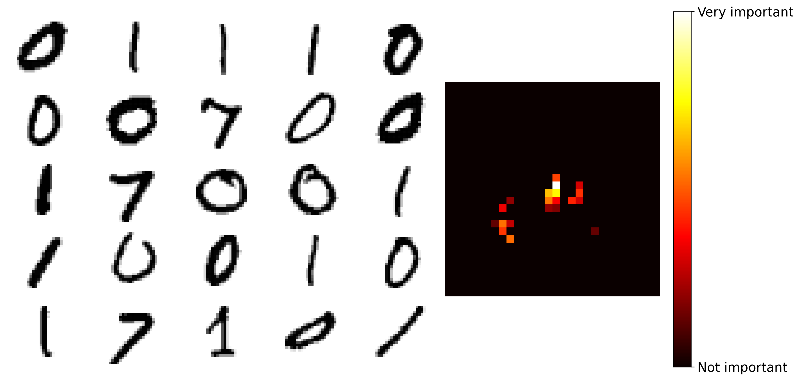
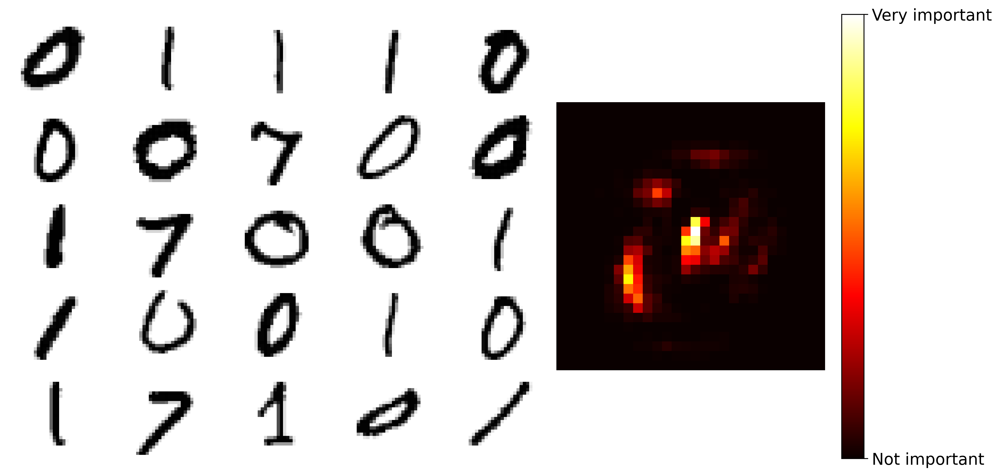

# mRMR

## Overview

**Maximum relevance miminum redundancy (mRMR)** is a filter-based feature selection method that explicitly considers redundancy among features while maximizing their relevance to the target variable. It has the particular advantage over some commonly used wrapper-based methods, such as Recursive Feature Elimination (RFE) and Boruta, in selecting a compact but informative set of features. 


## mRMR Variants

The core idea of mRMR is to select a feature subset `S` from the feature set `F`, such that: 


Classical mRMR employs mutual information for both relevance and redundancy calculations. However, this approach struggles with continuous data, as it requires estimating the probability density function (PDF), which is computationally expensive. As a workaround, one can
- Discretize the data: Convert continuous features into discrete bins.
- Use alternative metrics: F-statistic for relevance; Pearson correlation coefficient for redundancy.

### Normalization-Based Approach
A known drawback of mRMR is the imbalance between the two terms in the subtraction. To address this, **Vinh et al.** proposed normalizing each term:


Where:
- |Ω<sub>C</sub>|: Number of classes.
- *N*: Quantization level.

### Quotient-Based Approach
An alternative variation of mRMR considers the quotient of relevance and redundancy instead of their difference:


## Install
```bash
go get github.com/PQMark/mRMR
```

## Usage 
### Read Data
Use the `ReadCSV` helper function to load and preprocess your data from a CSV file.
```go
data, features, groups := mRMR.ReadCSV(
    "path/to/data.csv",
    []int{1, 4}, // (1-based) Irrelevant columns, e.g. columns 1 and 4
    []int{},     // (1-based) Irrelevant rows, e.g. none
    1,           // (1-based) Index for features info
    2,           // (1-based) Index for group info
    true,        // Each column is a feature, e.g. true
)
```

### mRMR
```go
mRMRData := mRMR.DatamRMR{X: data, Class: groups}
parasmRMR := mRMR.ParasmRMR{
    Data: mRMRData,
}
featureSelectedIndices, relevance, redundancyMap := parasmRMR.MRMR()
featureSelected := GetFeatures(features, featureSelectedIndices)
```

**Args for `ParasmRMR`:**

- **Discretization** (bool): Whether to discretize the data before feature selection.
- **BinSize** (int): Number of bins used if discretization is enabled.
- **Method** (string): Method for relevance/redundancy calculation.  
  *Options:* `"mi-mi"`, `"fs-pearson"`, `"nmi-nmi"` (Default: `"nmi-nmi"`).
- **Calculation** (string): How to combine relevance and redundancy measures.  
  *Options:* `"diff"`, `"quo"`.
- **MaxFeatures** (int): Maximum number of features to select.
- **RedundancyMethod** (string): Method for handling redundancy.  
  *Options:* `"avg"`, `"max"`.
- **Threshold** (float64): Controls the quantization error for normalized MI. (Default: `0.01`)
- **Verbose** (bool): If `true`, prints intermediate relevance, redundancy, and combined results.


## Example on MNIST
Both methods achieve a weighted F1 score above 95%. Remarkably, mRMR selects far fewer pixel features than Boruta while still maintaining comparable performance.  
**mRMR (mi-mi):**  
  

**Boruta:**  
  

- *Note: The importance scores are derived from a Random Forest trained on a stratified sample of 1,000 MNIST instances (digits 0, 1, and 7) with selected pixels, with 20% held out for testing.*
